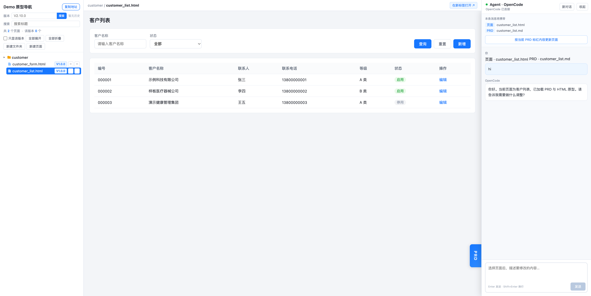

<div align="center">

# OpenPrototype

[English](README.md) | **简体中文**

**本地原型工作台 —— 左侧树形导航 · 中间原型预览 · 右侧 AI Agent**

让产品经理把「需求 → PRD → HTML 原型」跑成一个闭环，AI 就坐在原型旁边按 PRD 改页面。

*A local prototyping workbench: navigation tree · live preview · an AI agent that edits your HTML prototypes against their PRD.*


</div>

<table>
  <tr>
    <td></td>
    <td></td>
  </tr>
</table>


## 为什么要有它

产品经理做原型时的老问题：

- **PRD 和原型两张皮** —— 文档在 Word / Axure，原型在另一处，改一个字段要手动同步好几处，越改越对不上。
- **AI 会写代码，但不懂你的规矩** —— 直接让通用 AI 改原型，它会整页重写、命名混乱、把状态文案写死、破坏既有交互。
- **评审时页面散落各处** —— 几十个原型页没有统一入口，找页面、对版本靠记忆。

`openprototype` 把这三件事收进**一个本地工作台**：

1. **PRD（`.md`）和原型（`.html`）同目录并排放**，一处浏览、一处对齐。
2. **右侧 AI Agent 自动携带「当前页面 + 当前 PRD」上下文**，你说"把某字段改成 XX"，它只改相关部分、不整页重写；还能识别 PRD 里**标红**的增量改动精准落地。
3. **内置红线检查器**覆盖脚本顺序、数据层、状态常量化、字体栈与 `mode=view` 物理隐藏；配套 `auto-test` skill 会要求 Agent 在改完原型后执行检查。

> 一句话：**给"PM + AI 做原型"这件事，配一套有护栏的本地工作台。**

---

## ✨ 特性

- 🌲 **树形导航** —— 扫描产品目录自动生成页面树，支持标题模糊搜索、版本号徽标（从 PRD 版本表读取）、审核标记。
- 👁 **即时预览** —— 中间 iframe 直接渲染原型页面，点左侧即看。
- 🤖 **上下文感知的 AI Agent** —— 接本机 [OpenCode](https://opencode.ai)，每条消息自动带当前页面 + PRD 路径；一键"按 PRD 标红内容更新页面"。
- 🧱 **零后端的数据层** —— `BaseDataManager` 用 localStorage 做 CRUD，原型自带可交互假数据，不用起数据库。
- ✅ **自动化红线检查** —— 静态规则开箱可用；安装 Playwright 与 Chromium 后可增加真实浏览器冒烟测试。
- 📦 **脚手架分发** —— `create` 从零起项目、`init` 植入已有项目、`add-product` 加产品，`npm update openprototype` 升级框架运行时。
- 🖥 **跨平台** —— macOS / Windows / Linux 均可手动启动；常驻服务目前仅支持 macOS / Windows，OpenCode 路径自动探测。

---

## 🎯 适合谁 / 使用场景

**适合**
- **B 端 / 中后台产品经理**：需要快速做高保真、可交互原型，并让 PRD 与原型始终一致。
- **小团队 / 独立开发**：想用 AI 加速原型迭代，又不希望 AI 每次乱改、风格漂移。
- **需要沉淀规范的团队**：把自己的 PRD 模板、UI 规范放进 `rules/`，让 AI 按你的标准产出。

**典型场景**
| 场景 | 怎么用 |
|------|--------|
| 从需求快速出原型 | 写 PRD → 让 Agent 按 PRD 生成/补页面 → 预览调试 |
| 按 PRD 增量改原型 | 在 PRD 里把要改的地方**标红** → 点「按 PRD 标红内容更新页面」→ Agent 只改这部分 |
| 保持 PRD 与原型一致 | 任何字段/规则改动，Agent 同步改页面 + PRD + 假数据 |
| 需求评审 | 树形导航一处浏览所有页面，版本徽标一眼看齐版本 |
| 团队规范落地 | 规范写进 `rules/` + `CONVENTIONS.md`，检查器强制红线 |

**不适合**：写生产后端代码、数据库设计、正式前端工程（它是"原型 + PRD"阶段的工具，不是交付脚手架）。

---

## 🚀 快速开始

> 前置：核心运行时需要 Node ≥ 16；若要运行 Playwright 冒烟测试或参与仓库开发，请使用 Node ≥ 18。AI 面板另需本机 [OpenCode](https://opencode.ai)（见后文，可后装）。

### 场景 ①：从零建项目

```bash
npx openprototype create myapp
cd myapp
npm install
# 打开 http://127.0.0.1:8082/product/demo/pc/index.html
```

macOS / Windows 上，`npm install` 默认会注册并启动项目常驻服务，安装完成后直接打开上面的地址；不要再执行 `npm run serve`，否则会与常驻服务争用端口。Linux、禁用常驻服务或自动安装失败时，再执行：

```bash
npm run serve
```

首跑就带一个可交互的 demo 产品（客户列表 + 表单 + PRD），照着它加自己的页面即可。

### 场景 ②：植入已有项目

```bash
cd 你的项目
npm i openprototype
npx openprototype init
npx openprototype add-product shop
# 打开 http://127.0.0.1:8082/product/shop/pc/index.html
```

`init` 不覆盖已有模板文件，会补充缺失资产并合并 `package.json` 脚本；但它也会修改 `package.json`，且默认在 macOS / Windows 上注册并启动系统常驻服务。Linux 或未启用常驻服务时，运行 `npm run serve` 手动启动。如果常驻服务已经运行，`add-product` 修改配置后执行一次 `npx openprototype service restart`，让 Agent 加载新产品的写入范围。

### 常驻服务

常驻服务让工作台在登录后自动运行，每个项目独立注册。它目前仅支持 macOS LaunchAgent 与 Windows 计划任务；Linux 请使用 `npm run serve`。

```bash
npx openprototype service status
npx openprototype service restart
npx openprototype service logs
npx openprototype service uninstall
```

- 不想自动注册：在首次 `npm install` / `init` 前设置 `OPENPROTOTYPE_SERVICE_AUTO_INSTALL=0`，或提前在配置中设置 `"service": { "autoInstall": false }`。
- `service stop` 只停止本次运行，下次登录仍会启动；永久取消请用 `service uninstall`。
- 新增产品、修改端口或 Node 路径后，运行 `service restart` 让常驻服务加载新配置；升级包的安装钩子未自动重启成功时也应执行它。

---

## 🤖 AI Agent 怎么工作

右侧面板本质是**你项目里本机 OpenCode 的一个上下文感知外壳**：

```
你在面板输入  ──▶  本地 server (/api/agent)  ──▶  OpenCode (127.0.0.1)
     ▲                    │  自动注入：当前页面路径 + 当前 PRD 路径 + 页面红线约定
     └──── SSE 流式回显 ◀──┘  Agent 改完文件后预览自动刷新
```

- **自动带上下文**：点左侧任一页面，面板顶部就显示「本条消息将携带：页面 X / PRD Y」，无需你手动贴路径。
- **按 PRD 标红增量更新**：一键把 PRD 里 `<span style="color:red">…</span>` 标红的内容作为**唯一改动范围**发给 Agent —— 只改标红处，未标红的历史内容当背景，不重写、不"顺手优化"。
- **默认仅本机访问**：服务器默认只监听 `127.0.0.1`；所有写入与 Agent 接口（`/api/*`）只接受本机请求。
- **局域网开放边界**：使用 `--host 0.0.0.0` 后，局域网设备虽然不能调用写入与 Agent 接口，但能读取项目根目录下服务器可访问的非隐藏文件，不仅是原型页面。只应在可信网络和专用原型项目中使用，并确保项目中没有密钥或其他敏感文件。

### 安装 OpenCode（AI 面板前置）

```bash
npx openprototype doctor    # 一键体检 Node / OpenCode / 配置 / Playwright
```

- 安装见 https://opencode.ai ；装好后确认在 PATH：`which opencode`（Windows：`where opencode`）。
- 模型 / API key 由 OpenCode 自己管理（`opencode auth`），本工具只转发消息。
- 路径不在 PATH：在 `proto-kit.config.json` 的 `opencode.bin` 写绝对路径。

**没装 OpenCode 也能用** —— 导航 + 原型预览正常，只是右侧面板不可用。

---

## 🗂 目录结构与三层分离

```
你的项目/
├─ proto-kit.config.json     # 端口 / OpenCode / 产品列表（唯一配置入口）
├─ AGENTS.md                 # 给 AI 的协作规范（通用模板，你拥有可改）
├─ CONVENTIONS.md            # 检查器强制的页面红线说明（和运行时耦合）
├─ skills/                   # xiaojia（编码克制）+ auto-test（要求改完运行检查）
├─ rules/                    # 空目录：放你团队自己的 PRD 模板 / UI 规范
└─ product/<id>/pc/
   ├─ index.html             # 导航壳（薄，引用 /_kit 运行时）
   ├─ nav-tree.json          # 页面清单（nav:sync 自动生成）
   └─ …你的原型页面与 PRD.md
```

三层分离决定了**谁负责更新**，这也是干净升级的关键：

| 层 | 内容 | 归属 | 更新方式 |
|----|------|------|----------|
| **运行时** | 服务器 / shared 引擎 / Agent 面板 / 检查脚本 | 框架（挂在 `/_kit/`） | `npm update openprototype` |
| **可编辑资产** | `AGENTS.md` `CONVENTIONS.md` `skills/` + 你自建的 `rules/` | 你拥有 | `npx openprototype update` 输出手工对比与合并指引 |
| **业务内容** | 你的产品 PRD / 原型 / 数据 | 你拥有 | 你自己维护 |

> 框架只带**最小通用规范**（页面红线 + 编码克制）。PRD 模板、UI 规范、业务术语这类**方法论属于你**，放进 `rules/` 与 `product/<id>/`，不随框架分发、也不被升级覆盖。

**引擎回退解析**：页面用相对路径引用 `../shared/xxx.js` 时，若 `product/<id>/shared/` 下没有该文件，服务器自动回退到框架内置引擎（等价 `/_kit/shared/`）。因此：

- 通用引擎（`base-manager.js`、`common/*`、`styles.css`）**不必复制进产品目录**，升级框架即升级引擎；
- 产品目录只放自己的**业务组件与常量**（`shared/components/`、`shared/constants/`）和设计资源——这两个目录**永不回退**，缺失时直接 404 暴露问题，不会被框架的通用版静默顶替；
- 同名文件**本地优先**——从旧项目迁移时，可以按文件保留本地旧版逐步切换。

---

## 🧪 质量保障：红线检查器

`npx openprototype check` 会执行静态红线检查；安装 Playwright 与 Chromium 后，还会执行真实浏览器冒烟测试（详见 [CONVENTIONS.md](templates/CONVENTIONS.md)）：

- 脚本加载顺序固定 · 数据必须走 `BaseDataManager`（禁页面级 localStorage）
- 状态文案常量化（禁硬编码 `<option>`）· 禁 Google Fonts（系统字体栈）
- `?mode=view` 物理隐藏（`display:none`，非 `disabled`）· 打开页面无 console 报错

```bash
npm run check          # 扫全部页面
npm run check:changed  # 只扫 git 改动
```

首次启用浏览器层：

```bash
npm i -D playwright
npx playwright install chromium
```

未安装 Playwright 或 Chromium 时不能依赖浏览器层结果；安装完成后再把 `check` 视为完整检查。配套的 `auto-test` skill 会要求 Agent 在每次改完原型后运行检查并修完 ERROR；这是一条 Agent 工作流约定，不是服务器文件监听器。

---

## ⚙️ 配置 `proto-kit.config.json`

```json
{
  "port": 8082,
  "host": "127.0.0.1",
  "service": {
    "autoInstall": true
  },
  "opencode": {
    "bin": "auto",
    "model": "deepseek/deepseek-v4-flash",
    "agent": "build",
    "host": "127.0.0.1",
    "port": 4097,
    "startTimeoutMs": 15000
  },
  "products": [
    { "id": "demo", "roots": ["pc"] }
  ]
}
```

`host` 默认为 `127.0.0.1`。设为 `0.0.0.0` 会向局域网开放静态文件读取，请先阅读上面的安全边界；长期运行的常驻服务还需显式执行 `npx openprototype service install --allow-lan`。

环境变量可临时覆盖：`PROTO_KIT_PORT` · `PROTO_KIT_HOST` · `OPENCODE_BIN` · `OPENCODE_MODEL` · `OPENCODE_PORT`。
也可用 `npx openprototype serve --port 9000 --host 0.0.0.0` 临时指定端口 / 监听地址。

---

## 📟 命令

下表按“项目本地安装 `openprototype`”的默认场景统一使用 `npx`；如果已全局安装，可以省略 `npx`。`create` 会写入常用 npm scripts，`init` 在项目已有 `package.json` 时也会补充，因此日常可使用 `npm run serve`、`npm run check`、`npm run check:changed` 和 `npm run nav:sync`。

| 命令 | 作用 |
|------|------|
| `npx openprototype create <dir>` | 从零创建新项目（含可运行 demo） |
| `npx openprototype init` | 补充缺失资产、合并脚本，并按配置安装常驻服务 |
| `npx openprototype add-product <id> [--title <名称>]` | 新增一个 PC 产品壳，可指定显示名称 |
| `npx openprototype serve [--port <端口>] [--host <地址>]` | 前台启动本地服务器，可临时覆盖监听配置 |
| `npx openprototype service <action>` | 管理常驻服务：`install/start/stop/restart/status/logs/uninstall/prune` |
| `npx openprototype check [--changed] [--static-only] [路径]` | 检查全部、Git 改动或指定范围；可只跑静态规则 |
| `npx openprototype nav:sync` | 扫描产品目录并重建 `nav-tree.json` |
| `npx openprototype doctor` | 体检 Node / OpenCode / 配置 / Playwright / 常驻服务 |
| `npm update openprototype` | 按 `package.json` 的版本范围升级框架运行时包 |
| `npx openprototype update` | 仅打印可编辑资产的手工对比与合并指引，不执行升级 |

---

## 🛣 Roadmap

- [ ] **PageShell**：把完整页面壳（顶栏 + 菜单 + 设计系统）抽成产品无关组件，让 list/form/detail/approval 页面模板开箱即用（当前 demo 用自包含示例页）。
- [ ] **H5 端**：`add-product --h5` 移动端支持。
- [ ] 一键发布 / 剥离本地开发面板的 `publish` 命令（跨平台）。
- [ ] 更多示例产品与页面模板。

欢迎在 Issues 里提需求和反馈。

---

## 🤝 贡献

欢迎 PR。开发约定：

- 只用 Node 内置模块，运行时零依赖（检查器的 Playwright 是 devDependency）。
- 核心运行时支持 Node ≥ 16；完整安装当前 Playwright 依赖并跑检查需 Node ≥ 18。
- 改运行时后跑 `npm run check`；改壳 / Agent 面板后本地起服务实测三栏。
- 保持仓库**无任何私有信息**（公司 / 个人 / 内网地址 / 密钥）。

## 📄 License

[MIT](LICENSE)
